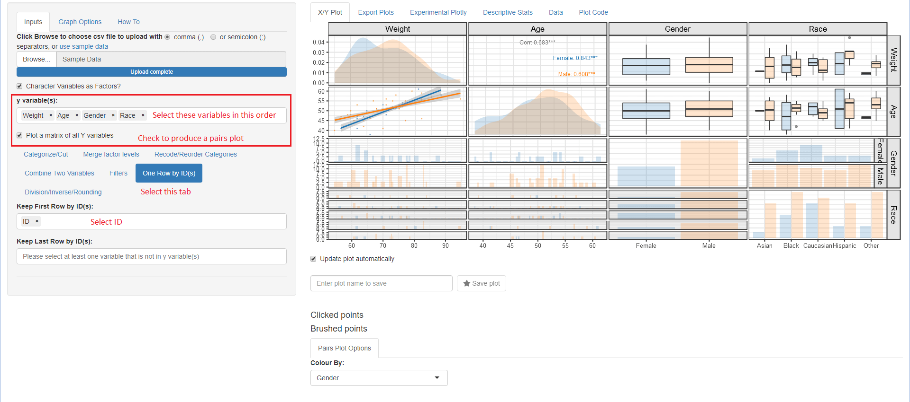

ggquickeda
========
[](https://travis-ci.org/smouksassi/ggquickeda)

### Installation and Running information
```
devtools::install_github("smouksassi/ggquickeda")
```
**To launch the application, use `run_ggquickeda()` (or `run_ggquickeda(data)` to load a specific dataset initially).**

R Shiny app/package as a handy interface to ggplot2. It enables you to quickly explore your data to detect trends on the fly. You can do scatter plots, dotplots, boxplots, barplots, histograms, densities and summary statistics of multiple variable(s) by column(s) splits. For a quick overview using an older version of the app head to this <a href="https://www.youtube.com/watch?v=1rBBmJUIZhs" target="_blank"> Youtube Tutorial </a>.

**Export Plots** and **Plot Code** tabs contributed by <a href="https://github.com/daattali" target="_blank">Dean Attali</a>. Once a plot is saved in the **X/Y Plot** tab by providing a name and hitting the **Save plot** star button it will become available for exporting. You can export in portrait, landscape and multiple plots per page.  
**Plot Code** will let you look at the source code that generated the plot with the various options.

Quick summary statistics tables using  <a href="https://github.com/benjaminrich" target="_blank">Benjamin Rich </a> table1 package.

The best way to learn is to load a data your are familiar with and start experimenting.
Try to reproduce the steps below using the included sample_df.csv. This will give you an idea on the kind of ouputs that can be generated.

### Example 1


### Example 2


### Example 3


### Example 4



Here is an overview of some of the things that can be done with the various menus:

### Inputs 

**Choose csv file to upload or use sample data**
This execute the code to load your csv file or the internal sample_data.csv:
```r
read.csv("youruploadeddata.csv",na.strings = c("NA","."))
```
Once your data is uploaded the first column will be selected for the **y variable(s):** and the second column for the **x variable:**, respectively. A simple scatter plot of y versus x variables is shown. 
ggquickeda can handle one or more y variable(s) selections but only one x variable.
Note that the x variable should be different from those selected for y variable(s).
Whether the user selects one or more y variable(s), the y variable(s) data will be automatically stacked (gathered) into two columns named yvalues (values) and yvars (identifier from which variable the value is coming from) and a scatter plot of yvalues versus x, faceted plot by yvars will be shown. Mixing categorical and continuous variables will render all yvalues to be treated as character. The order of the selected y variables(s) matters and can be changed via drag and drop. Selections can be removed by clicking on the small x.
When no y variable(s) is selected a histogram (if x variable is continous) or a barplot (if x variable is categorical) is shown. 

### Data Manipulations 
After selecting your y variable(s) if any and x variable you can directly proceed into data manipulation within the **Inputs** tab using the following subtabs. Note that the subtabs execution is sequential i.e. each subtab actions are executed in the order they appear. If the user changes an upstream action this will reset the subsequent ones.

* **Categorize/Cut:**
    + **Recode into Binned Categories:** Recode one or more continuous variable(s) into 2 to 10 categories as chosen with the **N of Cut Breaks** Slider.
    + **Treat as Categories:** Treat as a continous/numeric variable as a factor.
    + **Custom cuts of this variable:, defaults to min, median, max before any applied filtering:** cut a continuous/numeric variable into a set of bins delimited by the user selected values. By default the min, median, max are filled in int to the **varname Cuts** field and a two levels factor is generated: [min,median] (median,max]. User can change input a comma separated list for example:
min,value1,value2,max and then the following bins will be generated:
[min,value1] (value1,value2] (value2,max]. A Checkbox to treat the generated levels as continuous 0,1,... is provided to ease some plotting operations down the line.
    
       
* **Recode/Reorder Categories**
This subtab is dynamic in the sense that the user can add/remove variables. Once a non-numeric variable is selected another field with the current variable levels will be generated. The user can reorder the levels using drag and drop and/or edit a level by hitting Backspace and typing in a new character string. Note that the order chosen here might not be reflected on the yvalues a separate subtab after stacking is provided for this **Reorder Facets or axis Levels**

* **Combine Two Variables**
This enables the user to select two categorical variables Var1 with levels(V1L1,V1L2) and Var2 with levels(V2L1,V2L2) to generate a new variable named Var1_Var2 with levels V1L1_V2L1, V1L1_V2L2, V1L2_V2L1, V1L2_V2L2 and so on.

* **Filters**
Up to six sequential filters, three for any type of variable **Filter variable (1)**,**Filter variable (2)** or **Filter variable (3)** and three for continuous variables  **Filter continuous (1)**, **Filter continuous (2)** or **Filter continuous (3)**.
* **One Row by ID(s)**
Filter the data down to distinct values (one row) of the selected variable(s) which are usually identifiers for subjects, occasions, arms etc. In long data format several variable that are time invariant are repeated this helps in removing the repetitions. User might want the first row of each subject or the first row of each subject/occasion combination etc.
* **Simple Rounding**
Rounding a numerical variable to a specified number of digits. It can help to come up with a crude binning.
* **Reorder Facets or axis Levels**
Enables the user to reorder the yvalues using a statistical function (Median, Mean, Minimum or Maximum of another variable) with a checkbox to quickly reverse the order, if desired.
The user can also manually drag and drop an order and change the name of the levels where \n is recongnized as a line break.

### Graph Options
Various options to tweak the plot:
* Controlling y and x axis labels, legends and other commonly used theme options.
* Adding a title, subtitle and a caption

### How To
A shorter version of this walkthrough within the app.

### X/Y Plot
Main plot is output here with the various options to generate the plot below the possibilities include:

### Summary/Regression functions 
* **Plot types, Points, Lines (?)**
Selecting scatter plots points and or lines with control over transparency and more.
* **Color/Group/Split/Size/Fill Mappings (?)**
`ggplot2` built-in functionality for Group, color, size, fill mappings as well as up to two variable for column and row splits (faceting).
* **Boxplots**
* **Histograms/Density/Bar**
* **Quantile Regression (?)**
* **Smooth/Linear/Logistic Regressions (?)**
* **Mean CI (?)**  Mean Confidence Intervals
* **Median PIs (?)** Median Prediction Intervals
* **Kaplan-Meier (?)** Survival K-M curves
* **Correlation Coefficient (?)** add a text label with the correlation coefficient

### Additional Information
Installing the package should handle the installation of all dependencies. There are listed here in case you are curious:
```
install.packages(c("shiny","shinyjs","colourpicker","ggplot2","scales","DT","tidyr","dplyr","Hmisc","quantreg","markdown","rlang","lazyeval","ggrepel","plotly","devtools"))
```
It also depends on two github packages ggkm and table1 that can be installed via the commands below:
```
devtools::install_github("sachsmc/ggkm")
devtools::install_github("benjaminrich/table1")
```
The app can also be directly lauched using this command
```
shiny::runGitHub('ggquickeda', 'smouksassi', subdir = 'inst/shinyapp')
```

