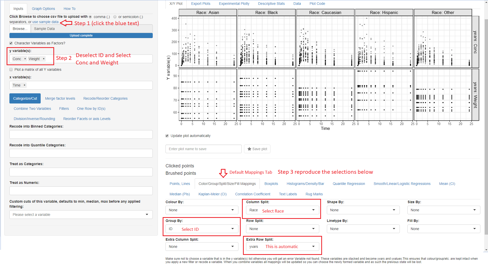

ggquickeda
========


[](https://cran.r-project.org/package=ggquickeda)
[](https://github.com/smouksassi/ggquickeda/actions)


### Installation and Running information
```
# Install from CRAN:
install.packages("ggquickeda")

# Or the development version from GitHub:
# install.packages("remotes")
remotes::install_github("smouksassi/ggquickeda")

```

### Usage

To use your **pre-existing csv file** launch the shiny app then navigate to your csv file and load it.
```
run_ggquickeda()
```

To use your **data that is already in R** launch the shiny app with the dataset object as an argument:
```
run_ggquickeda(myRdataset)
```

`ggquickeda` is an R `Shiny` app/package providing a graphical user interface (GUI) to `ggplot2` and `table1`. 

It enables you to quickly explore your data and to detect trends on the fly. You can do scatter plots, dotplots, boxplots, barplots, histograms, densities and summary statistics of one or multiple variable(s) by column(s) splits and an optional overall column.  

It also has the `km`, `kmband` and `kmticks` geoms/stats to facilitate the plotting of **Kaplan-Meier** Survival curves 

For a quick overview using an older version of the app head to this <a href="https://www.youtube.com/watch?v=1rBBmJUIZhs" target="_blank"> Youtube Tutorial </a>.

The best way to learn how to use ggquickeda is to load a data your are familiar with and start experimenting.
Try to reproduce the steps below using the included sample_df.csv. This will give you an idea about the visuals and summaries that can be generated.  

The package has also two vignettes:  
1. <a href="https://cran.r-project.org/package=ggquickeda/vignettes/ggquickeda.html"  target="_blank"> Introduction to ggquickeda </a>.   
2. <a href="https://cran.r-project.org/package=ggquickeda/vignettes/AdditionalPlotsStats.html"  target="_blank"> Additional Plots and Stats with ggquickeda </a>.  
3. <a href="https://cran.r-project.org/package=ggquickeda/vignettes/Visualizing_Summary_Data.html"  target="_blank"> Visualizing Summary Data with ggquickeda </a>.  

### Example 1


### Example 2


### Example 3


The **Export Plots** and **Plot Code** tabs were contributed along many other additions and capabilities by <a href="https://github.com/daattali" target="_blank">Dean Attali</a>. Once a plot is saved in the **X/Y Plot** tab by providing a name and hitting the **Save plot** star button it will become available for exporting. You can export in portrait, landscape and multiple plots per page.  
The **Plot Code** tab will let you look at the source code that generated the plot with the various options. This is helpful to get you to know ggplot2 code.

The Quick summary statistics tables using  <a href="https://github.com/benjaminrich" target="_blank">Benjamin Rich </a> `table1` package.

Here is a high level overview of some of the things that can be done with the various menus:

## Details 

### Inputs 

**Choose csv file to upload or use sample data**
This execute the code to load your csv file or the internal sample_data.csv:
```r
read.csv("youruploadeddata.csv",na.strings = c("NA","."))
```
Once your data is uploaded the first column will be selected for the **y variable(s):** and the second column for the **x variable:**, respectively. A simple scatter plot of y versus x variables is shown. 
ggquickeda can handle one or more y variable(s) selections and more recently one or more x variable(s).
Note that the x variable(x) should be different from those selected for y variable(s).
Whether the user selects one or more y variable(s), the y variable(s) data will be automatically stacked (gathered) into two columns named yvalues (values) and yvars (identifier from which variable the value is coming from) and a scatter plot of yvalues versus x, faceted plot by yvars will be shown. Mixing categorical and continuous variables will render all yvalues to be treated as character. The order of the selected y variables(s) matters and can be changed via drag and drop. Selections can be removed by clicking on the small x.
When no y variable(s) is selected a histogram (if x variable is continuous) or a barplot (if x variable is categorical) is shown.

The same applies when ore or more x variable(x) where the values are named (xvalues) and the identifier variable name is (xvars). When no x variable(s) is selected a histogram (if y variable is continuous) or a barplot (if y variable is categorical) is shown.

### Data Manipulations 
After selecting your y variable(s) if any and x variable you can directly proceed into data manipulation within the **Inputs** tab using the following subtabs. Note that the subtabs execution is sequential i.e. each subtab actions are executed in the order they appear. If the user changes an upstream action this will reset the subsequent ones.

* **Categorize/Cut:**
    + **Recode into Binned Categories:** Recode one or more continuous variable(s) into 2 to 10 categories as chosen with the **N of Cut Breaks** Slider.
    + **Recode into Quantile Categories:** Recode one or more continuous variables(s) into chosen number **N of Quantiles**. Powered by `table1::eqcut`. Additional options is to treat zero as separate category (Placebo) and or to treat missing as a separate category as well.
    + **Treat as Categories:** Treat a continuous/numeric variable as a factor.
    + **Treat as Numeric:** Treat a factor variable as numeric.
    + **Custom cuts of this variable:, defaults to min, median, max before any applied filtering:** cut a continuous/numeric variable into a set of bins delimited by the user selected values. By default the min, median, max are filled in int to the **varname Cuts** field and a two levels factor is generated: [min,median] (median,max]. User can change input a comma separated list for example:
min,value1,value2,max and then the following bins will be generated:
[min,value1] (value1,value2] (value2,max]. A Checkbox to treat the generated levels as continuous 0,1,... is provided to ease some plotting operations down the line.
* **Merge factor levels**  
This subtab is dynamic in the sense that the user can add/remove fields.
    + **Factor to merge (1):** Check the boxes of categories you want to pool together.
    + **Factor to merge (n...):** If user  click the + Merge another group it will create a new field to iteratively merge categories of interest.
* **Recode/Reorder Categories**
This subtab is dynamic in the sense that the user can add/remove variables. Once a non-numeric variable is selected another field with the current variable levels will be generated. The user can reorder the levels using drag and drop and/or edit a level by hitting Backspace and typing in a new character string. Note that the order chosen here will not be reflected on the yvalues/xvalues and a separate subtab after stacking is provided for this **Reorder Facets or axis Levels**
* **Combine Two Variables**
This enables the user to select two categorical variables Var1 with levels(V1L1,V1L2) and Var2 with levels(V2L1,V2L2) to generate a new variable named Var1_Var2 with levels V1L1_V2L1, V1L1_V2L2, V1L2_V2L1, V1L2_V2L2 and so on.
* **Filters**
Up to six sequential filters, three for any type of variable **Filter variable (1)**,**Filter variable (2)** or **Filter variable (3)** and three for continuous variables  **Filter continuous (1)**, **Filter continuous (2)** or **Filter continuous (3)**.
* **One Row by ID(s)**
    + **Keep First Row by ID(s)**
Filter the data down to distinct values (one row) of the selected variable(s) which are usually identifiers for subjects, occasions, arms etc. In long data format several variable that are time invariant are repeated this helps in removing the repetitions. User might want the first row of each subject or the first row of each subject/occasion combination etc.
    + **Keep Last Row by ID(s)**
Same as the One Row by ID(s) but keeping the last row instead.
* **Division/Inverse/Rounding**
    + **Round the Values to the Specified N Digits:** Rounding a numerical variable to a specified number of digits **N Digits**. It can help to come up with a crude binning.
    + **Divide the Values by the specified column:** Divide a column e.g. concentration by another like dose.
    + **Divide the Values by a constant:** Divide by specified constant for quick unit conversions.
* **Reorder Facets or axis Levels**
Enables the user to reorder the yvalues/xvalues using a statistical function (Median, Mean, Minimum, Maximum, length, length of unique values, standard deviation and sum of another variable) with a checkbox to quickly reverse the order, if desired.
The user can also manually drag and drop the levels order and change the name of the levels where \n is recognized as a line break.

### Graph Options
Various options to tweak the plot:
* Controlling y and x axis labels, legends and other commonly used theme options.
* Adding a title, subtitle and a caption
* Controlling color palette, themes, reference lines and more.

### How To
A shorter version of this walk-through within the app.

### X/Y Plot
Main plot is output here with the various options to generate the plot below the possibilities include:

### Summary/Regression functions 
* **Points, Lines**
Selecting scatter plots points and or lines with control over transparency and more.
* **Color/Group/Split/Size/Fill Mappings**
`ggplot2` built-in functionality for Group, color, size, fill mappings as well as up to two variables for column and row splits (faceting).
* **Boxplots**
* **Histograms/Density/Bar**
* **Quantile Regression**
* **Smooth/Linear/Logistic Regressions**
* **Mean (CI)**  Mean Confidence Intervals
* **Median (PIs)** Median Prediction Intervals
* **Kaplan-Meier (CI)** Survival K-M curves
* **Correlation Coefficient** add a text label with the correlation coefficient
* **Text Labels** add a text label from a column existent in the data
* **Rug Marks** add rug marks to the side of the plot

### Additional Information

Installing the package should handle the installation of all dependencies.  

The app can also be directly launched using this command:

```
shiny::runGitHub('ggquickeda', 'smouksassi', subdir = 'inst/shinyapp')
```

