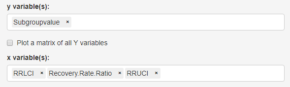
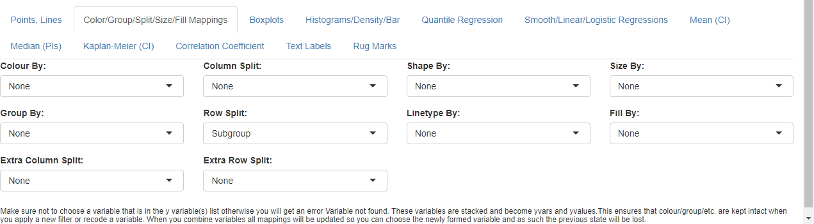
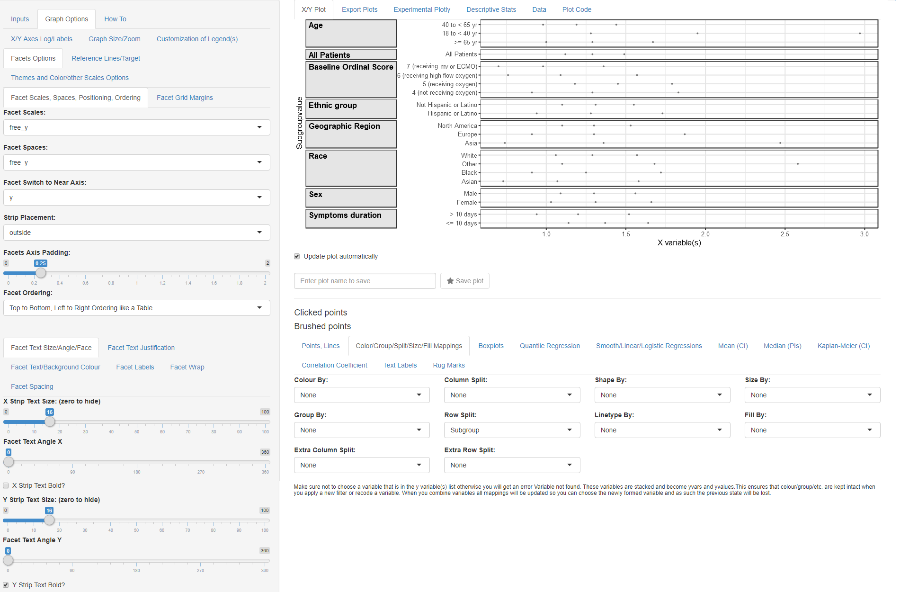
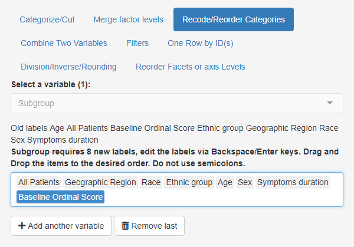
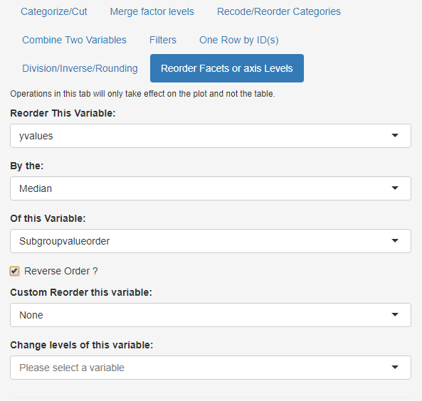
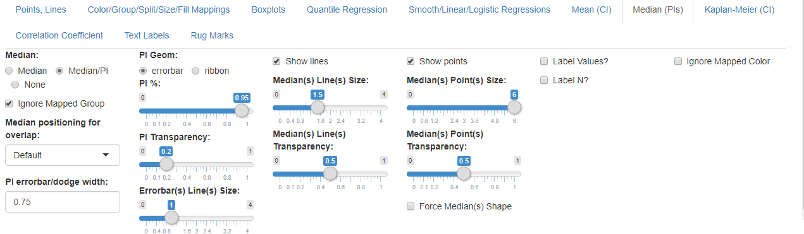
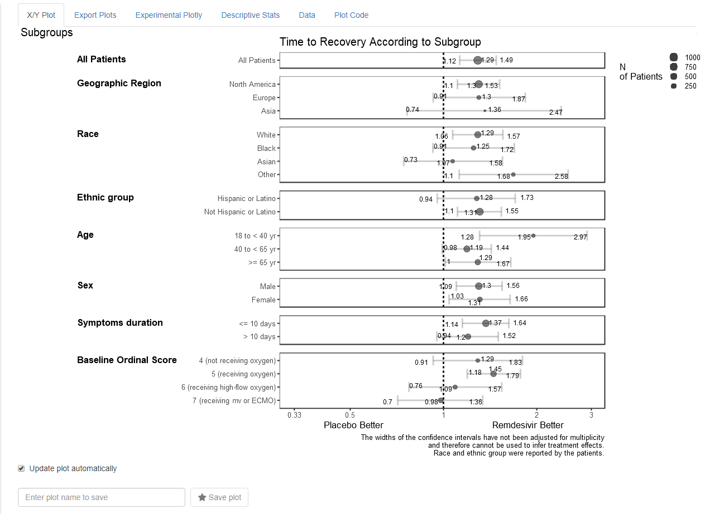

# Visualizing Summary Data

In this vignette we will demo how to visualize data which is only
available in summary format as it is coming from a published paper table
or figure for example Figure 3 from this paper:

“Remdesivir for the Treatment of Covid-19 — Final Report”


JH Beigel et al. N Engl J Med 2020. DOI: 10.1056/NEJMoa2007764

### Published Data

The data has been made available in a csv data file named
`remdesivirfig3.csv`

``` r
library(ggquickeda) #load ggquickeda
remdesivirdata <- read.csv("./remdesivirfig3.csv") # in vignette folder
knitr::kable(remdesivirdata)
```

| Subgroup               | Subgroupvalue                  | Subgroupvalueorder | N.of.patients | Recovery.Rate.Ratio | RRLCI | RRUCI |
|:-----------------------|:-------------------------------|-------------------:|--------------:|--------------------:|------:|------:|
| All Patients           |                                |                  1 |          1062 |                1.29 |  1.12 |  1.49 |
| Geographic Region      | North America                  |                  2 |           847 |                1.30 |  1.10 |  1.53 |
| Geographic Region      | Europe                         |                  3 |           163 |                1.30 |  0.91 |  1.87 |
| Geographic Region      | Asia                           |                  4 |            52 |                1.36 |  0.74 |  2.47 |
| Race                   | White                          |                  5 |           566 |                1.29 |  1.06 |  1.57 |
| Race                   | Black                          |                  6 |           226 |                1.25 |  0.91 |  1.72 |
| Race                   | Asian                          |                  7 |           135 |                1.07 |  0.73 |  1.58 |
| Race                   | Other                          |                  8 |           135 |                1.68 |  1.10 |  2.58 |
| Ethnic group           | Hispanic or Latino             |                  9 |           250 |                1.28 |  0.94 |  1.73 |
| Ethnic group           | Not Hispanic or Latino         |                 10 |           755 |                1.31 |  1.10 |  1.55 |
| Age                    | 18 to \< 40 yr                 |                 11 |           119 |                1.95 |  1.28 |  2.97 |
| Age                    | 40 to \< 65 yr                 |                 12 |           559 |                1.19 |  0.98 |  1.44 |
| Age                    | \>= 65 yr                      |                 13 |           384 |                1.29 |  1.00 |  1.67 |
| Sex                    | Male                           |                 14 |           684 |                1.30 |  1.09 |  1.56 |
| Sex                    | Female                         |                 15 |           278 |                1.31 |  1.03 |  1.66 |
| Symptoms duration      | \<= 10 days                    |                 16 |           676 |                1.37 |  1.14 |  1.64 |
| Symptoms duration      | \> 10 days                     |                 17 |           383 |                1.20 |  0.94 |  1.52 |
| Baseline Ordinal Score | 4 (not receiving oxygen)       |                 18 |           138 |                1.29 |  0.91 |  1.83 |
| Baseline Ordinal Score | 5 (receiving oxygen)           |                 19 |           435 |                1.45 |  1.18 |  1.79 |
| Baseline Ordinal Score | 6 (receiving high-flow oxygen) |                 20 |           193 |                1.09 |  0.76 |  1.57 |
| Baseline Ordinal Score | 7 (receiving mv or ECMO)       |                 21 |           285 |                0.98 |  0.70 |  1.36 |

### Load the Data into the app

``` r
# from R launch the app with the data 
#run_ggquickeda(remdesivirdata) 
# if you have access the the app on a server browse to the file and load it
```

### X/Y Mappings and Splitting Options

- After the app finishes loading the data:
  - Change the mapped **y variable(s)** to ‘Subgroupvalue’  
  - Change the mapped **x variable(s)** to ‘RRLCI’, ‘Recovery Rate
    Ratio’ and ‘RRUCI’



Summary Data Mapping

- Go to **Color/Group/Split/Size/Fill Mappings** below the graph
  - cancel the automatic **Extra Column Split** and set it to ‘None’
  - set **Select Row Split** to ‘Subgroup’.



Graph Splitting

### Facets Options

- Go to **Graph Options** tab and select the **Facets Options** subtab.
  We will be using advanced Faceting (graph splitting options):
  - Set **Facet Scales** to ‘free_y’ (this allows only Subgroupvalue
    specific to the Subgroup to appear on each graph panel)
  - Set **Facet Spaces** to ‘free_y’ (this allows for each panel to
    occupy space proportional to the number of unique Subgroupvalue)
  - Set **Facet Switch to Near Axis** to ‘y’ (this will move the y
    strips to the left)
  - Set **Strip Placement** to ‘outside’ (this will put the y strips to
    the left of the axis)

We still have to set text formatting options using the group of subtabs
in the lower part of the page:

- Default subtab: **Facet Text Size/Angle/Face**
  - Set **Facet Text Angle Y** to 0 (if not automatically set)
  - Check the **Y strip Text Bold**
- Second subtab: **Facet Text Justification**
  - Set **Facet Text Vertical Justification Y** to 1
  - Set **Facet Text Horizontal Justification Y** to 0  
    (not shown in the screenshot)
- Fourth subtab: **Facet Labels**
  - Set **Facet Label** to ‘Value(s)’  
    (not shown in the screenshot)

At this point you should have this graph:



Facet Options

### Ordering of Variables and Values

- Go to main **Inputs** tab and select the **Recode/Reorder Categories**
  subtab.
  - Set **Select a variable(s)** to ‘Subgroup’
  - Drag and drop the order of levels as in the screenshot



reordering of subgroup

While you can add another variable and manually drag and drop we will
demo next another possibility to reorder yvalues using a statistic
(e.g. median) of another variable (Subroupvalueorder):

- Select the **Reorder Facets or axis Levels** subtab
  - Set **Reorder This Variable** to ‘yvalues’
  - Keep **By the:** to ‘Median’
  - Set **Of this Variable:** to ‘Subroupvalueorder’



reordering of Subgroupvalue

### Remove Default Points and add a Point Interval

- Select the **Points, Lines** subtab
  - Set **Points** to ‘None’
- Select the **Median (PIs)** subtab
  - Set **Median** to ‘Median/PI’
  - Set **PI Geom:** to ‘errorbar’
  - Set **PI %:** to 1 (this ensures that the errorbar goes from the min
    to max of values)
  - Uncheck **Show lines** and check **Show points**
  - Set **Median(s) Point(s) Size:** to 6



Median/PI options

### Setting Titles, Captions and Logging the X axis

- Select the **Graph Options** subtab next to the **Inputs** and in the
  first default subtab **X/Y Axes Log/Labels**:
  - Type in one space in the **Y axis label** (this removes the default
    label)
  - Type in one space in the **X axis label** (this removes the default
    label)
  - Type in “Time to Recovery According to Subgroup” in the **Plot
    Title** field
  - Type in “The widths of the confidence intervals have not been
    adjusted for multiplicity\nand therefore cannot be used to infer
    treatment effects.\nRace and ethnic group were reported by the
    patients.” in the **Plot Caption** field (notice how the\n produce a
    line break)
  - Set **X Axis scale** to ‘log10’

And now you should get the below plot !: 

### Example of what is Possible with `ggquickeda`

As an example of even more advanced features consider the screenshot
below where the Intervals Values are shown while the point Size is
proportional to the N of patients. Some theme adjustments to customize
the plot and legend were also done.



more options
