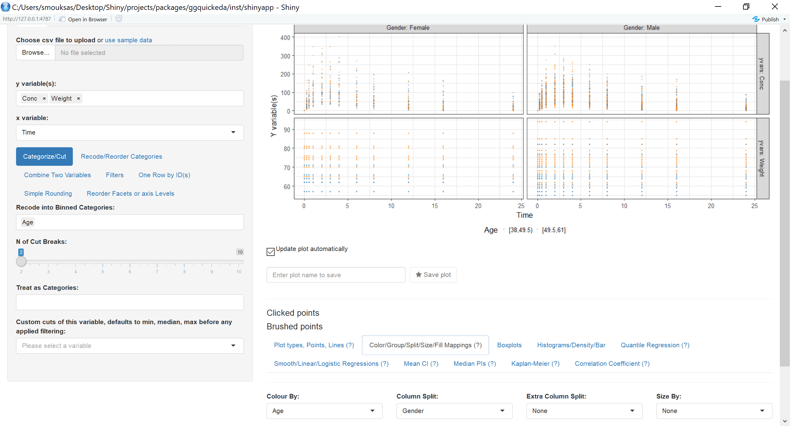
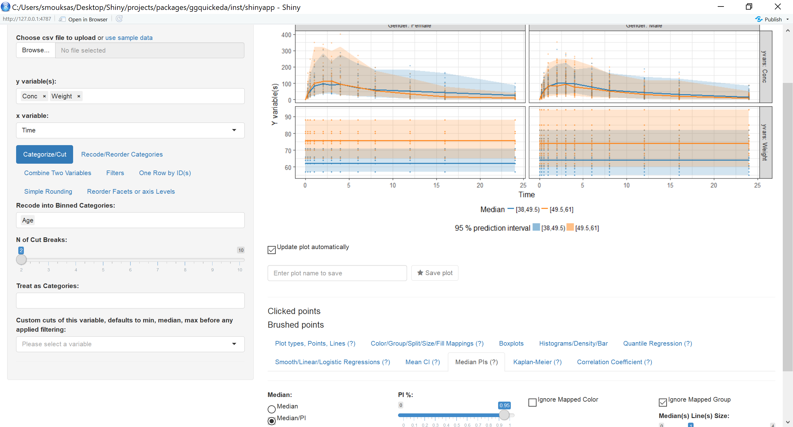
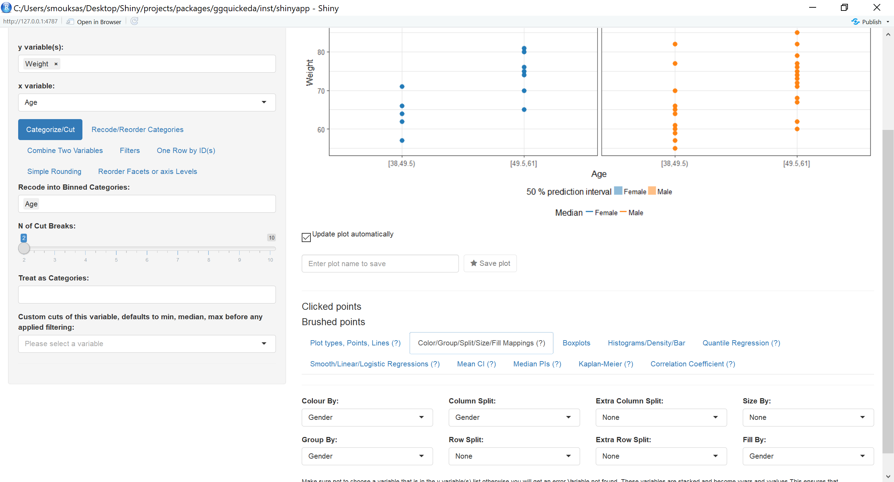
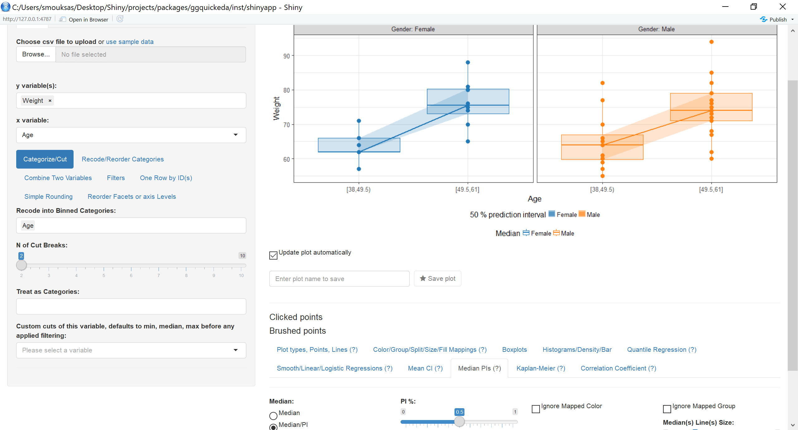
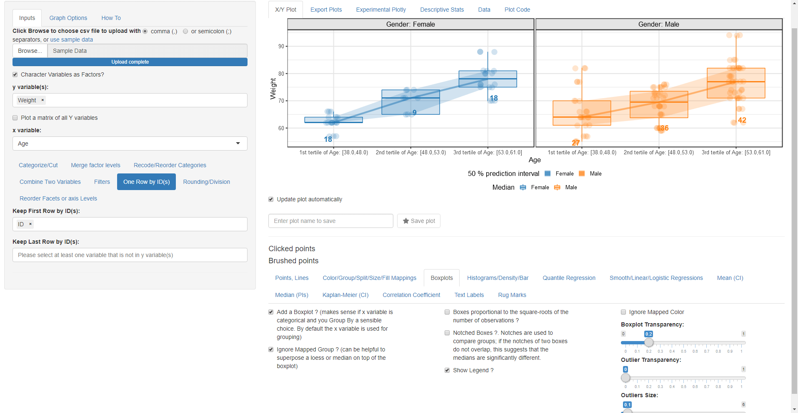
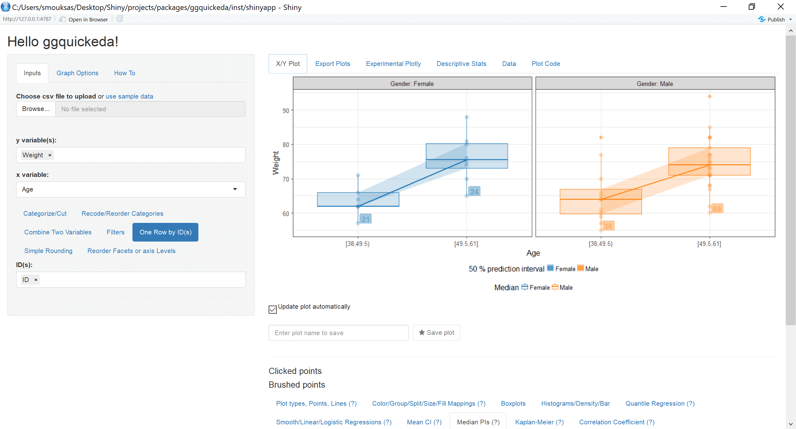
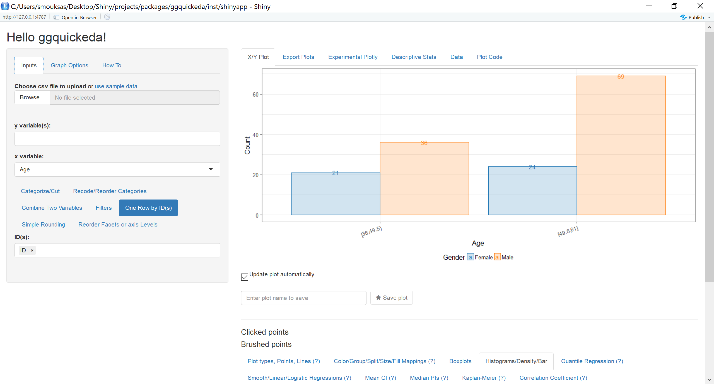
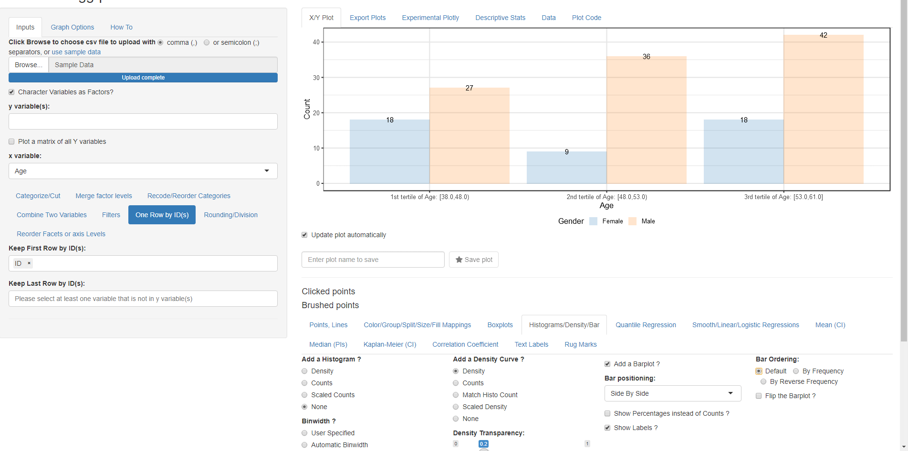
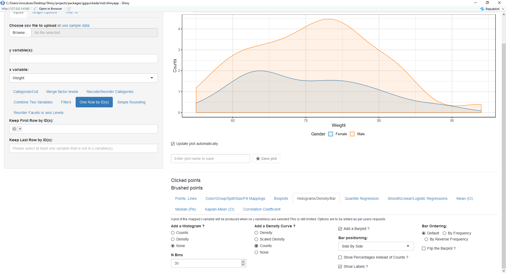

```{r setup, include = FALSE}
knitr::opts_chunk$set(
  collapse = TRUE,
  comment = "#>"
)
```

In this vignette we will expand what we learned in the Introduction to ggquickeda vignette.
We will again launch the app and select the built-in dataset.
Then we will do the following actions:

* Change the mapped y variable(s) to Conc and Dose
* In the **Categorize/cut** subtab select Age to be cut into three binned categories
* In the **Categorize/cut** subtab select Weight to be cut into three quantiles categories (new option)
* Go to **Color/Group/Split/Size/Fill Mappings (?)** and map Colour By and Fill By to Age and Column Split to Weight the Extra Row split is automatically set to yvars since you have selected more than one y variable. 

{width=100%}

* Go to **Median PIs (?)** and select Median/PI and then you this get this plot:

{width=100%}

This illustrated how to use more than one y variable and how to generate a Median and a Ribbon showing a 95% Prediction interval (default) over the x variable (Time). We can see that Dose does not change over time and that the highest Age category is only present in the middle and third weight category (older subjects have higher weights).
Next we will look at the Weight distributions in different ways first using a boxplot:

* Change the mapped y variable(s) to Weight and x variable to Age and remove Weight from Recode into Quantile Categories and select Age instead.
* Go to **Plot types, Points, Lines(?)** and increase Point Size to 2.4 and make the transparency of the points equal to 0.58
* Explore the jitter position including the custom one
* Go to **Color/Group/Split/Size/Fill Mappings (?)** and map Color By:, Group By: Fill By: and Column Split: to Gender
{width=100%}
* Go To **Median PI(?)** and uncheck **Ignore Mapped Group** so the Median PI uses the mapped Gender Group By:.
* Try to experiment what Label Values? and Label N? do Keep Label N? checked.
* Apply all the selected options in the screenshot
{width=100%}
* Go to **Boxplots** and check the Add a Boxplot? checkbox.
* Explore how you can resize outliers and remove the legend.
{width=100%}

* Next go to the **Mean (CI)** menu select Mean and check Show points and Force Mean(s) Shape
* Try to play with the various shapes options and or the size of the mean point(s).

{width=100%}


In the following part we will generate a descriptive stats table that reflect the plot that we just did.
* But first let us fix the fact that Weight is repeated multiple time by subject as it does not change over time.
Go to **One Row by ID(s)** and map it to ID.

* Click on the **Descriptive Stats** Tab
* Map Extra Column Split to Gender and explore with the Flip the order of the columns checkbox

{width=100%}

To explore some of the univariate plots,remove all y variable(s) keeping Age as x variable gives:

{width=100%}

Then selecting Weight as x variable gives:

{width=100%}

As an exercise play with the options in the **Histograms/Density/Bar** to reproduce these plots.
