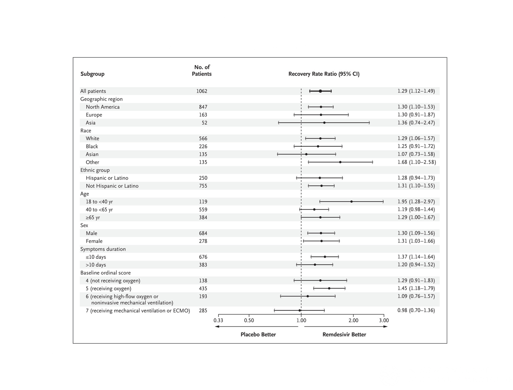
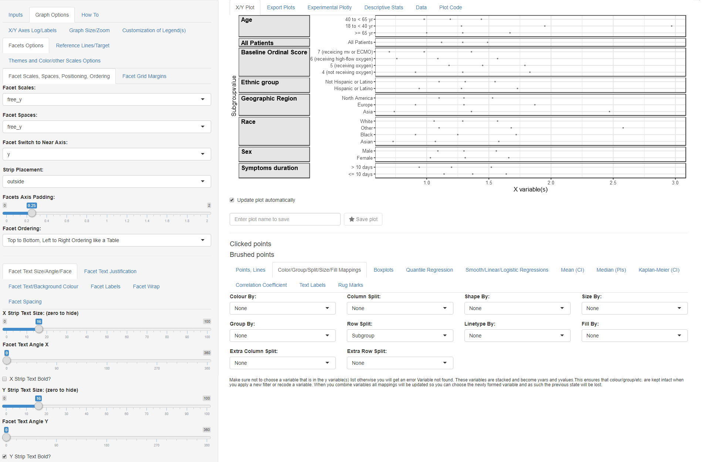
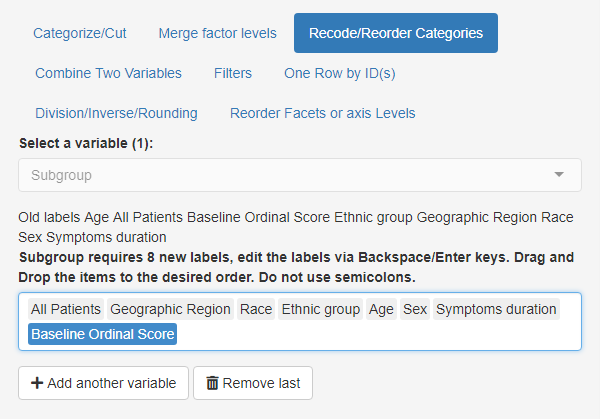
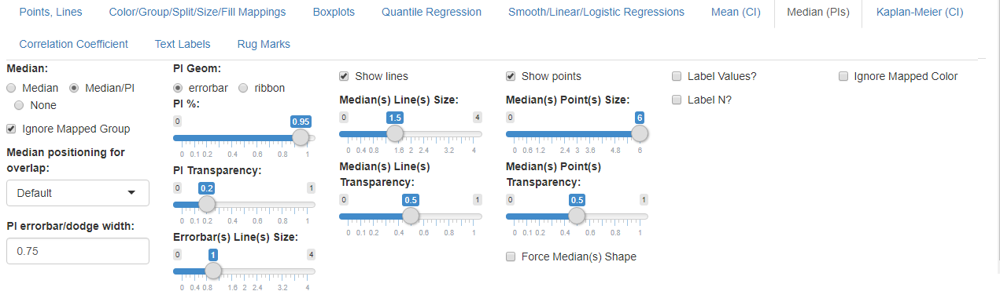
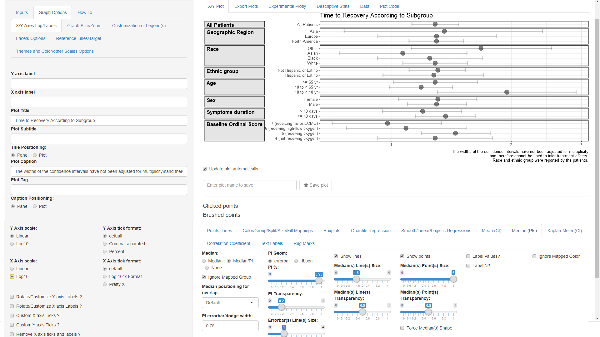
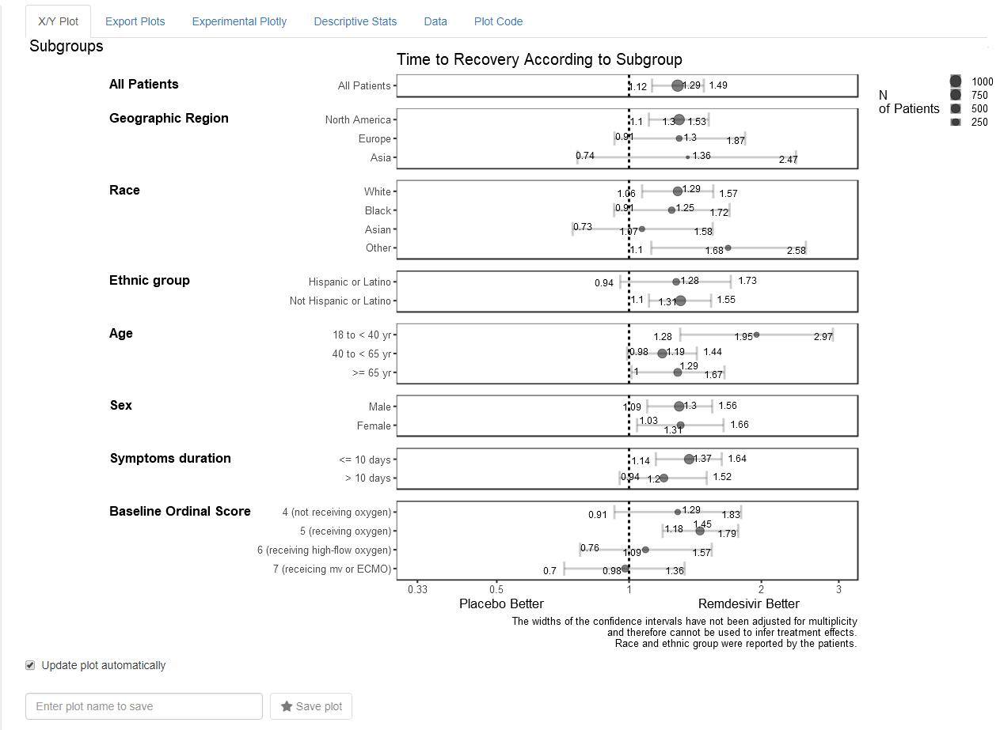

```{r, include = FALSE}
knitr::opts_chunk$set(
  collapse = TRUE,
  comment = "#>"
)
```

In this vignette we will demo how to visualize data which is only available in summary format as it is coming from a published paper table or figure for example Figure 3 from this paper:  

"Remdesivir for the Treatment of Covid-19 — Final Report"

{width=100%}

### Published Data 

The data has been made available in a csv data file named `remdesivirfig3.csv`

```{r datainput, echo=TRUE, warning=FALSE, message=FALSE}
library(ggquickeda) #load ggquickeda
remdesivirdata <- read.csv("./remdesivirfig3.csv") # in vignette folder
knitr::kable(remdesivirdata)
```
### Load the Data into the app 

```{r runtheapp, echo=TRUE, warning=FALSE, message=FALSE}
# from R launch the app with the data 
#run_ggquickeda(remdesivirdata) 
# if you have access the the app on a server browse to the file and load it

```

### X/Y Mappings and Splitting Options 

* After the app finishes loading the data:  
    + Change the mapped **y variable(s)** to 'Subgroupvalue'  
    + Change the mapped **x variable(s)** to 'RRLCI', 'Recovery Rate Ratio' and  'RRUCI' 
    
{width=70%}

* Go to **Color/Group/Split/Size/Fill Mappings** below the graph
    + cancel the automatic **Extra Column Split** and set it to 'None'
    + set **Select Row Split** to 'Subgroup'.
    
{width=70%}

### Facets Options 

* Go to **Graph Options** tab and select the **Facets Options** subtab. We will be using advanced Faceting (graph splitting options):
    + Set **Facet Scales** to 'free_y' (this allows only Subgroupvalue specific to the Subgroup to appear on each graph panel)
    + Set **Facet Spaces** to 'free_y' (this allows for each panel to occupy space proportional to the number of unique Subgroupvalue)
    + Set **Facet Switch to Near Axis** to 'y' (this will move the y strips to the left)

We still have to set text formatting options using the group of subtabs in the lower part of the page:  

* Default subtab: **Facet Text Size/Angle/Face**    
    + Set **Facet Text Angle Y** to 0
    + Check the **Y strip Text Bold**

* Second subtab: **Facet Text Justification**  
    + Set **Facet Text Vertical Justification Y** to 1 
    + Set **Facet Text Horizontal Justification Y** to 0     
(not shown in the screenshot)
* Fourth subtab: **Facet Labels**  
    + Set **Facet Label** to 'Value(s)'  
(not shown in the screenshot)
    
At this point you should have this graph:  

{width=100%}

### Ordering of Variables and Values 

* Go to main **Inputs** tab and select the **Recode/Reorder Categories** subtab. 
    + Set **Select a variable(s)** to  'Subgroup'
    + Drag and drop the order of levels as in the screenshot

{width=50%}

While you can add another variable and manually drag and drop we will demo next another possibility to reorder yvalues using a statistic of another variable e.g. median:

* Select the **Reorder Facets or axis Levels** subtab 
    + Set **Reorder This Variable** to  'yvalues'
    + Keep **By the:** to  'Median'
    + Set **Of this Variable:** to 'Subroupvalueorder' 
    
{width=50%}

### Remove Default Points and add a Point Interval 

* Select the **Points, Lines** subtab 
    + Set **Points** to  'None'

* Select the **Median (PIs)** subtab 
    + Set **Median** to  'Median/PI'
    + Set **PI Geom:** to  'errorbar'
    + Set **PI %:** to 1 (this ensures to use the min and max for the errorbar)
    + Check **Show points**
    + Set **Median(s) Point(s) Size:** to 6
    
{width=75%}

### Setting Titles, Captions and Logging the X axis

* Select the **Graph Options** subtab next to the **Inputs** and in the first default subtab **X/Y Axes Log/Labels**:   
    + Type in one space in the  **Y axis label** (this removes the default label)
    + Type in one space in the  **X axis label** (this removes the default label)
    + Type in "Time to Recovery According to Subgroup" in the **Plot Title** field
    + Type in "The widths of the confidence intervals have not been adjusted for multiplicity\\nand therefore cannot be used to infer treatment effects.\\nRace and ethnic group were reported by the patients." in the **Plot Caption** field (notice how the\\n produce a line break)
    + Set **X Axis scale** to 'log10'

And now you should get the below plot !: 
{width=100%}

### Example of what is Possible with `ggquickeda`

As an example of even more advanced features consider the screenshot below where the N of patients as well as the Intervals Values are shown.

{width=100%}
