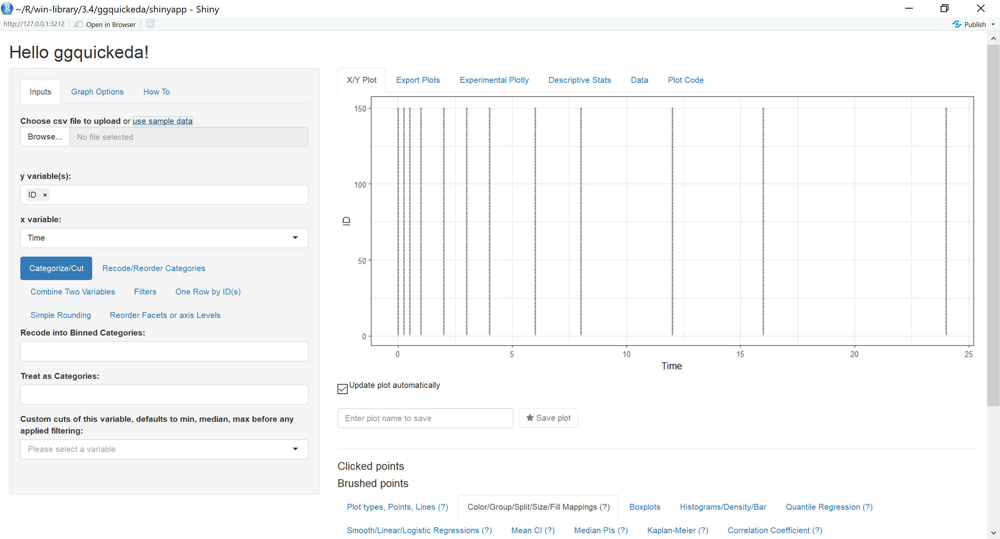
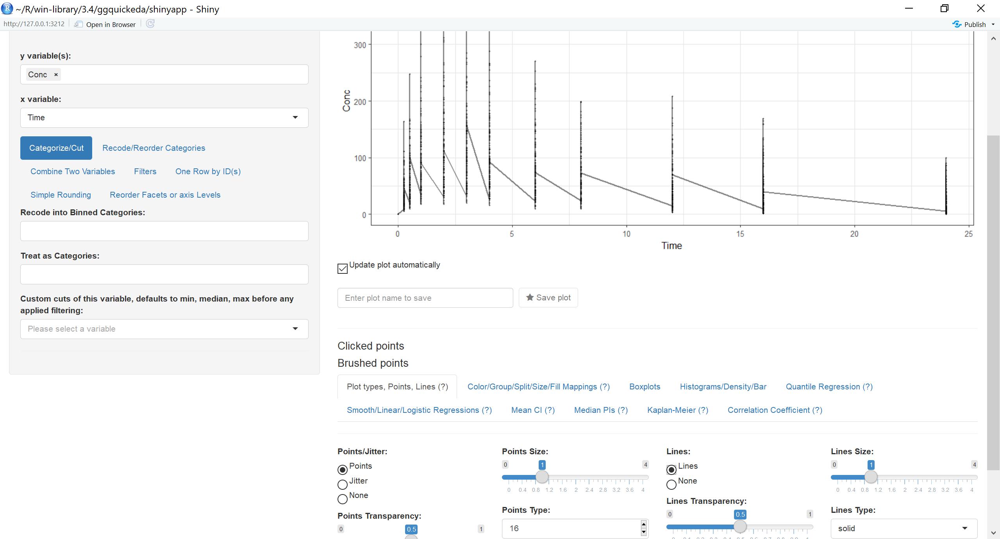
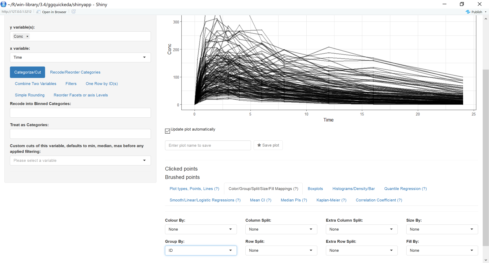
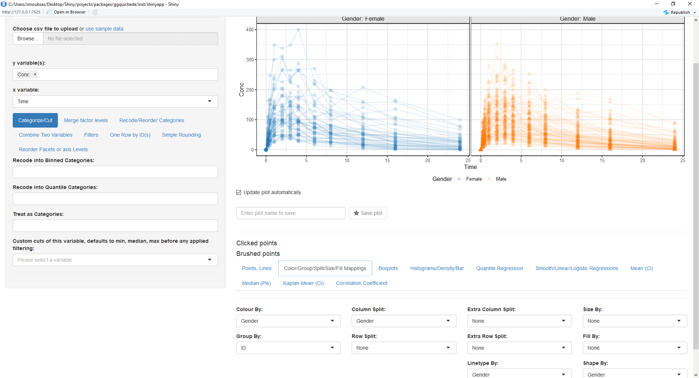
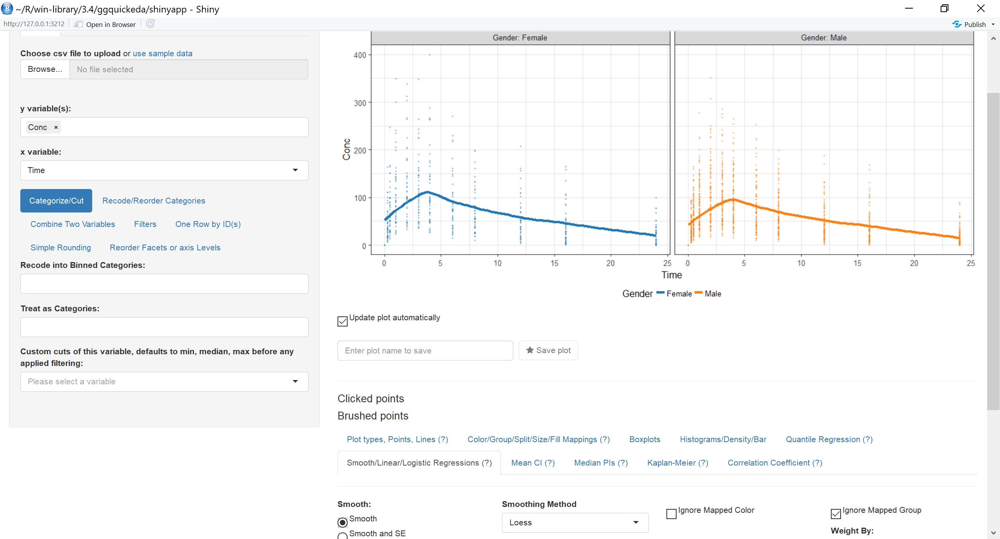
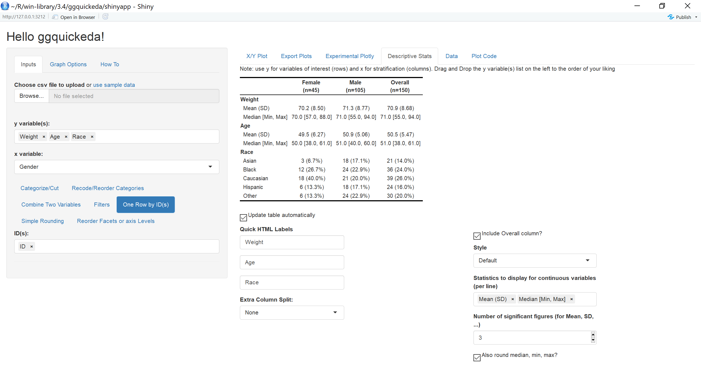

```{r setup, include = FALSE}
knitr::opts_chunk$set(
  collapse = TRUE,
  comment = "#>"
)
```

This package/R Shiny app is a handy interface to ggplot2/table1. It enables you to quickly explore your data to detect trends on the fly. You can do scatter plots, dotplots, boxplots, barplots, histograms, densities and summary statistics tables
For a quick overview using an older version of the app head to this <a href="https://www.youtube.com/watch?v=1rBBmJUIZhs" target="_blank"> Youtube Tutorial </a>.
To get started:
```
devtools::install_github("smouksassi/ggquickeda")
library(ggquickeda)
```
Let us start by launching the app `run_ggquickeda()` and clicking on use sample_data:
The app will load the built-in example dataset and map the first column to y variable(s) and the second column to x variable and a simple scatter plot with points will be generated:
{width=100%}

We want to look at the Column Conc (concentration of drug in blood) versus Time joining each Subject data with a line:

* Change the mapped y variable(s) from ID to Conc
* Go to **Plot types, Points, Lines(?)** and select Lines
{width=100%}

Wait something is wrong! We forgot to tell the app that we want to group by ID.

* Go Back to **Color/Group/Split/Size/Fill Mappings (?)** and select ID for the Group By:

{width=100%}
While we are on this tab let us map Color By:, Column Split:, Linetype By: and Shape By: to Gender
{width=100%}
Now we want to add a loess trend line:
* Go to  **Smooth/Linear/Logistic Regressions (?)** and click on the Smooth radio button:

{width=100%}
After we made the plot we wanted, now we are interested to do a summary statistics of Weight and Age columns by Gender this will require the following steps:
* Change the mapped y variable(s) to Weight, Age and Race  
* Go to **One Row by ID(s)** and select ID so we keep one row by ID  
* Go to **Descriptive Stats** tab
(notice how you can use html codes for line breaks, superscript and subscript in the Quick HTML Labels)
{width=100%}

Now launch the application on your own data and start exploring:
**`run_ggquickeda(yourdataname)`**
